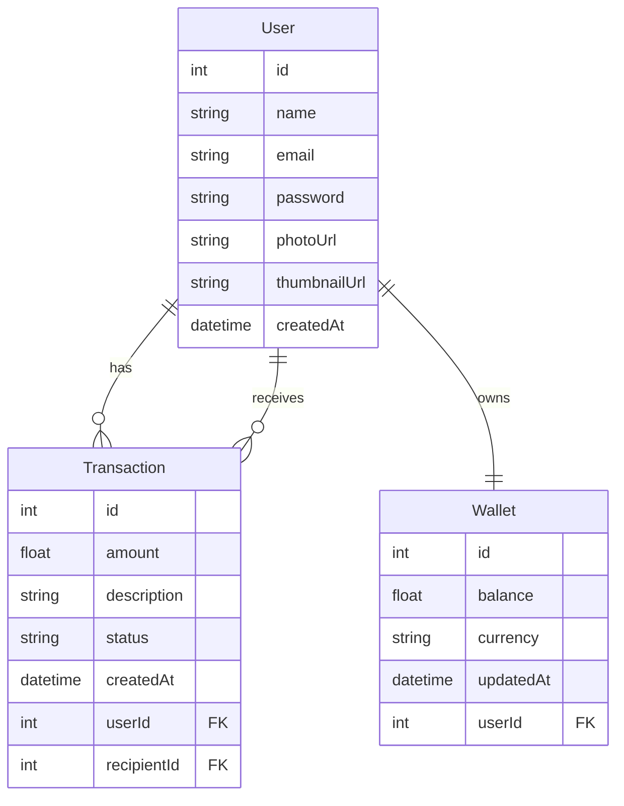

# sendmoney-api

## User has:
### One Wallet (1:1)
### Many Transactions as sender (1:N)
### Many Transactions as recipient via recipientId (1:N)
## Transaction includes both userId (sender) and recipientId (receiver)
## Wallet belongs to one User

